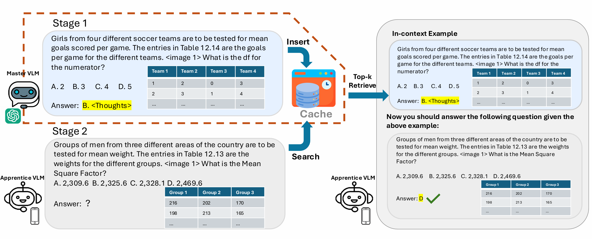

<div align="center">

# 🧠 Cache-of-Thought: Master-Apprentice Framework for Cost-Effective Vision Language Model Reasoning

[📄 Paper (EMNLP 2025 Main)] (https://aclanthology.org/2025.emnlp-main.97/) 

</div>



Paste your OpenAI API key into the configurations file. Some of our functionality will require OpenAI API calls, they are listed below:
```
--gptresp
--teacher gpt-4o
```

For Open-Flamingo
```
conda create -n myenv python=3.10
conda activate myenv
conda install cudatoolkit=11.8
pip install -r flamingo_requirements.txt
pip install git+https://github.com/openai/CLIP.git --no-build-isolation
```

For Qwen
```
conda create -n myenv python=3.12
conda activate myenv
conda install nvidia::cuda-toolkit==12.0.0
pip install -r qwen_requirements.txt
pip install git+https://github.com/openai/CLIP.git --no-build-isolation
```

All preparations have been done to replicate our results, however, it's up to you to rerun the codes.
Preparation example for evaluating MMMU dev dataset:
```
python3 __main__.py --mode prep --gptresp --gptembd --gptkeyw --dataset mmmu --slice val
```
This will prepare your cache responses, keywords and embeddings. By defaults, MMMU (same dataset) dev (complementary slice to val) will be responsed by GPT-4o and image only embeddings will be generated. However, you can manually add 
```
--cacheset --cacheslice --embedding --alternative
```
for advanced setups.

Running Open-Flamingo:
```
python3 __main__.py --mode eval --dataset mmmu --slice val --model flamingo --modelsize 3B
```
This is the minimum setup to run our framework. You can manually add 
```
--cacheset --cacheslice --embedding --alternative --queryembedding --shot --cachesize
```

Running Qwen:
```
python3 __main__.py --mode eval --dataset mmmu --slice val --model qwen --modelsize 2B
```
This is the minimum setup to run our framework. You can manually add 
```
--cacheset --cacheslice --embedding --alternative --queryembedding --shot --teacher --filter --dynamic --prob --hierachical
```

All input parameters:
```
--mode = ['prep', 'eval'] # Required.
--model = ['qwen', 'flamingo'] # Required.
--modelsize = ['2B', '3B', '4B', '7B', '9B', '72Bint4'] # Required. 2B, 7B and 72Bint4 are for Qwen models and 3B, 4B, 9B are for Open-Flamingo models.
--dataset = ['mmmu', 'clevr', 'textocr'] # Required.
--slice = ['dev', 'val'] # Required.
--cacheset = ['mmmu', 'clevr', 'textocr'] # Default value is the same as dataset.
--cacheslice = ['dev', 'val'] # Default value is the complementary of slice.
--shot = [1, 2, ...] # The number of example retrieved. Default value is 1.
--embedding = ['image', 'image_text'] # The feature on which cache data embeddings are calculated. Default value is 'image', meaning embeddings are only calculated based on question images.
--queryembedding = ['image', 'image_query', 'image_response', 'image_response_subfield'] # Default value is 'image_response'. 'image_response_subfield' is only valid for MMMU. This command decides how responses embeddings are produced to match cache records.
--alternative = ['_baseline', ' ', '_subfield'] # Default is '' for no special need, try '_baseline' for question embedding and '_subfield' for class embedding (MMMU only).
```

Preparation mode only parameters:
```
--gptresp # Generate GPT-4o responses for the cache dataset slice
--gptkeyw # Generate Llama3.1 keywords for the cache dataset slice
--gptembd # Generate CLIP embeddings for the cache dataset slice
# The following two commands only work with --gptembd
--embedding = ['image', 'image_text'] # The feature on which cache data embeddings are calculated. Default value is 'image', meaning embeddings are only calculated based on question images.
--alternative = ['_baseline', ' ', '_subfield'] # Default is '' for no special need, try '_baseline' for question embedding and '_subfield' for class embedding (MMMU only).
```

Open-Flamingo only parameters:
```
--cachesize = ['', '_half'] # Default is '' and choose '_half' to reduce cache size to half.
```

Qwen only parameters:
```
--dynamic # Default is false. This command allow dynamic calling of teacher model instead of relying on pre-generated responses.
--prob = [0-1] # Default is 0.5. The probability of teacher model being called when each query is being processed.
--teacher = ['gpt-4o', '7B'] # Default value is 'gpt-4o'. This command fix your teacher model.
# The following two commands only work with MMMU dataset.
--filter = ['', 'subfield'] # Default is '' and type in 'subfield' to further filter questions with the same subfield.
--hierachical # Default is false. This is one advanced retrieval method, which needs extra tuning for better performance.
```
## 🔜 Upcoming

- [ ] Code for hierarchical memory cache design/

# 🔗 Citation

If you use our work, please consider citing:

```bibtex
@inproceedings{wu-etal-2025-cache,
    title = "Cache-of-Thought: Master-Apprentice Framework for Cost-Effective Vision Language Model Reasoning",
    author = "Wu, Mingyuan  and
      Jiang, Jize  and
      Zheng, Haozhen  and
      Li, Meitang  and
      Li, Zhaoheng  and
      Tian, Beitong  and
      Chen, Bo  and
      Park, Yongjoo  and
      Zhang, Minjia  and
      Zhai, ChengXiang  and
      Nahrstedt, Klara",
    editor = "Christodoulopoulos, Christos  and
      Chakraborty, Tanmoy  and
      Rose, Carolyn  and
      Peng, Violet",
    booktitle = "Proceedings of the 2025 Conference on Empirical Methods in Natural Language Processing",
    month = nov,
    year = "2025",
    address = "Suzhou, China",
    publisher = "Association for Computational Linguistics",
    url = "https://aclanthology.org/2025.emnlp-main.97/",
    doi = "10.18653/v1/2025.emnlp-main.97",
    pages = "1895--1909",
    ISBN = "979-8-89176-332-6",
    abstract = "Vision Language Models (VLMs) have achieved remarkable success in a wide range of vision applications of increasing complexity and scales, yet choosing the right VLM model size involves a trade-off between response quality and cost. While smaller VLMs are cheaper to run, they typically produce responses only marginally better than random guessing on benchmarks such as MMMU. In this paper, we propose \textit{Cache of Thought (CoT)}, a master{--}apprentice framework for collaborative inference between large and small VLMs. CoT manages high-quality query results from large VLMs (\textit{master}) in a cache, which are then selected via a novel multi-modal retrieval and in-context learning to aid the performance of small VLMs (\textit{apprentice}). We extensively evaluate CoT on various widely-recognized and challenging general reasoning benchmarks, and show that CoT increases overall reasoning performance by up to 7.7{\%} under the same budget, and specifically boosts the reasoning performance of apprentice VLMs by up to 36.6{\%}. Our code is available at \url{https://github.com/UIUC-MONET/Cache-of-Thoughts}."
}
